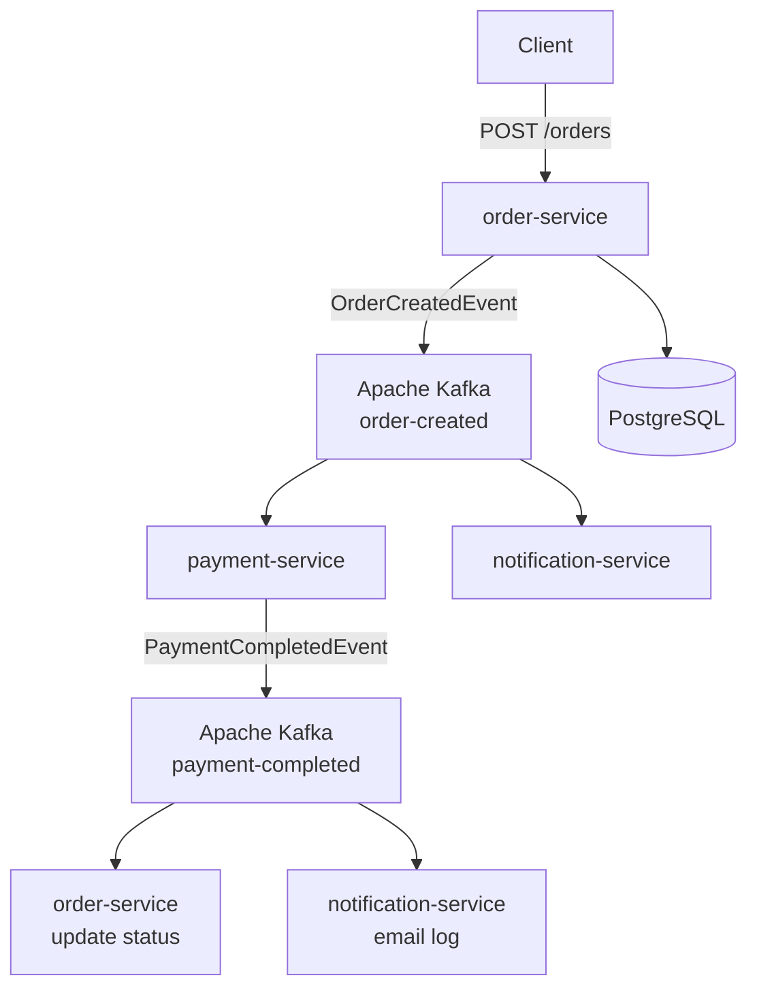
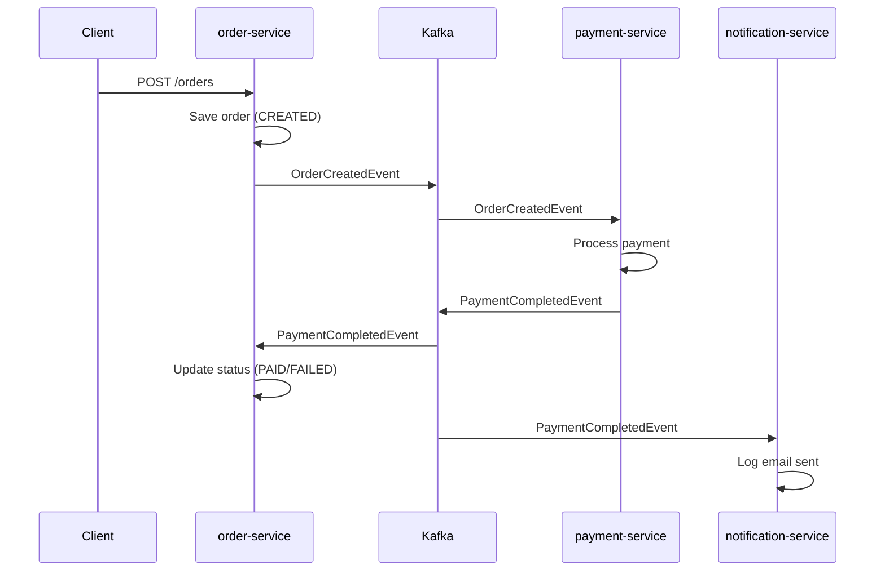

# 🍕 Mini Food Delivery Platform

A microservices-based food delivery platform built for learning and demonstrating
modern backend engineering practices: event-driven architecture, asynchronous communication,
containerization, and distributed systems.

---

## Architecture

---

## Tech Stack

| Technology | Purpose |
|---|---|
| Java 21 | Primary language |
| Spring Boot 3.4 | Application framework |
| Spring Data JPA | Database access |
| Spring Kafka | Kafka integration |
| Apache Kafka | Async event streaming |
| PostgreSQL | Relational database |
| Liquibase | Database migrations |
| Docker / Docker Compose | Containerization |
| Lombok | Boilerplate reduction |
| Maven | Build tool |

---

## Services

### order-service (port 8080)
- Accepts REST requests to create orders
- Persists orders to PostgreSQL
- Publishes `OrderCreatedEvent` to Kafka
- Listens for `PaymentCompletedEvent` and updates order status

### payment-service (port 8081)
- Listens for `OrderCreatedEvent` from Kafka
- Simulates payment processing
- Publishes `PaymentCompletedEvent` to Kafka

### notification-service (port 8082)
- Listens for `PaymentCompletedEvent` from Kafka
- Simulates email notification (logs to console)

---

## Event Flow

---

## How to Run

### Prerequisites
- Docker Desktop
- Java 21+
- Maven 3.9+

### 1. Clone the repository

```bash
git clone https://github.com/your-username/mini-food-delivery-platform.git
cd mini-food-delivery-platform
```

### 2. Start infrastructure

```bash
docker-compose up -d postgres zookeeper kafka kafka-ui
```

### 3. Build the project

```bash
mvn clean install -DskipTests
```

### 4. Run services

Run each service from IntelliJ IDEA or via terminal:

```bash
# order-service
cd order-service && mvn spring-boot:run

# payment-service
cd payment-service && mvn spring-boot:run

# notification-service
cd notification-service && mvn spring-boot:run
```

### 5. Insert test data

```sql
INSERT INTO customers (name, email, phone_number)
VALUES ('John Doe', 'john@example.com', '+380991234567');

INSERT INTO items (name, price)
VALUES ('Pizza Margherita', 12.99),
       ('Cola', 2.50);
```

### Kafka UI
Open [http://localhost:8090](http://localhost:8090) to monitor Kafka topics and messages.

---

## API Endpoints

### order-service

| Method | Endpoint | Description |
|---|---|---|
| POST | `/orders` | Create a new order |
| GET | `/orders/{id}` | Get order by ID |
| GET | `/orders/customer/{customerId}` | Get orders by customer |

### Create Order — Request Body

```json
{
  "customerId": 1,
  "items": [
    { "itemId": 1, "quantity": 2 },
    { "itemId": 2, "quantity": 1 }
  ]
}
```

### Create Order — Response

```json
{
  "id": 1,
  "customerId": 1,
  "items": [
    {
      "itemId": 1,
      "itemName": "Pizza Margherita",
      "itemPrice": 12.99,
      "quantity": 2
    },
    {
      "itemId": 2,
      "itemName": "Cola",
      "itemPrice": 2.50,
      "quantity": 1
    }
  ],
  "total": 28.48,
  "status": "CREATED",
  "createdAt": "2026-05-20T20:00:00"
}
```

---

## Project Structure
```bash
mini-food-delivery-platform/
├── common/                        # Shared Kafka events
│   └── src/main/java/com/fooddelivery/common/
│       └── event/
│           ├── OrderCreatedEvent.java
│           └── PaymentCompletedEvent.java
├── order-service/                 # Main service
├── payment-service/               # Payment processing
├── notification-service/          # Email notifications
├── docker-compose.yml
└── README.md
```
---

## What I Learned

- Designing microservices with clear bounded contexts
- Implementing asynchronous communication with Apache Kafka
- Managing database schema migrations with Liquibase
- Containerizing Spring Boot applications with Docker
- Handling distributed systems challenges (event ordering, retries, error handling)