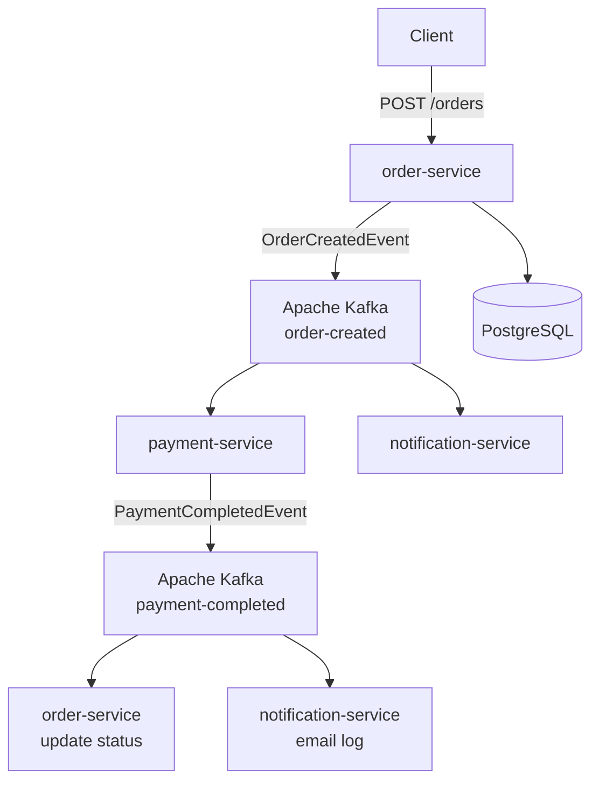
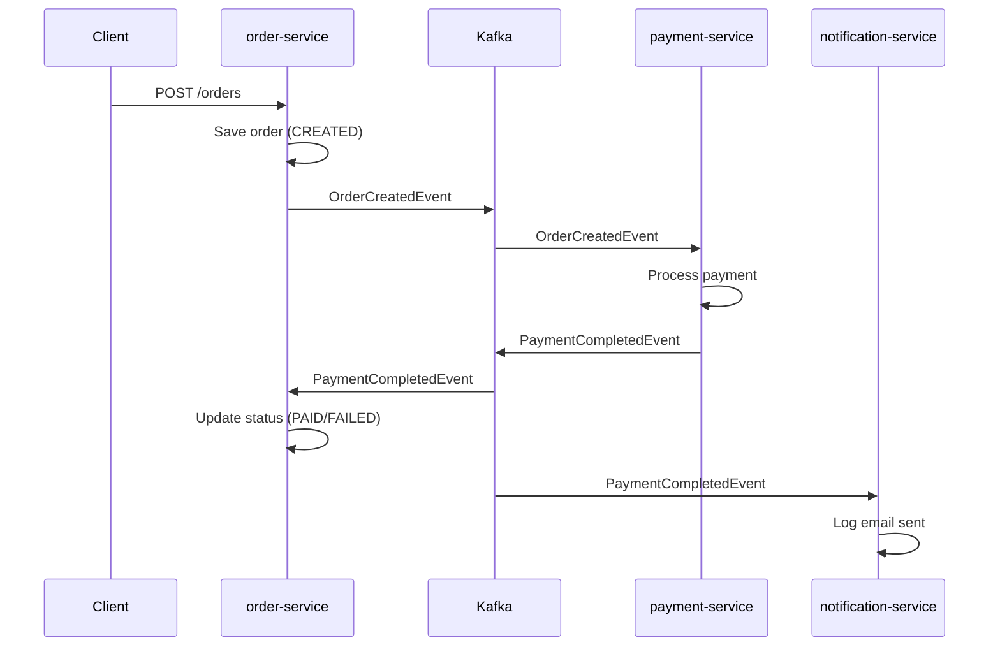

# 🍕 Mini Food Delivery Platform

A microservices-based food delivery platform built for learning and demonstrating
modern backend engineering practices: event-driven architecture, asynchronous communication,
containerization, and distributed systems.

---

## Architecture

---

## Tech Stack

| Technology | Purpose |
|---|---|
| Java 21 | Primary language |
| Spring Boot 3.4 | Application framework |
| Spring Data JPA | Database access |
| Spring Kafka 3.3 | Kafka integration |
| Apache Kafka | Async event streaming |
| PostgreSQL 16 | Relational database |
| Liquibase | Database migrations |
| Docker / Docker Compose | Containerization |
| Prometheus + Grafana | Monitoring and observability |
| Lombok | Boilerplate reduction |
| Maven | Multi-module build tool |
| JUnit 5 + Mockito | Unit testing |
| GitHub Actions | CI/CD pipeline |

---

## Services

### order-service (port 8080)
- Accepts REST requests to create orders
- Validates request data with Bean Validation
- Persists orders and order items to PostgreSQL via JPA
- Publishes `OrderCreatedEvent` to Kafka topic `order-created`
- Listens for `PaymentCompletedEvent` and updates order status to `PAID` or `FAILED`
- Exposes metrics via Spring Boot Actuator + Micrometer

### payment-service (port 8081)
- Listens for `OrderCreatedEvent` from Kafka
- Simulates payment processing (90% success rate)
- Publishes `PaymentCompletedEvent` to Kafka topic `payment-completed`

### notification-service (port 8082)
- Listens for `PaymentCompletedEvent` from Kafka
- Simulates email notification (logs to console)

### common (shared library)
- Contains shared Kafka event classes: `OrderCreatedEvent`, `PaymentCompletedEvent`
- Used by all three services to avoid code duplication

---

## Event Flow

---

## How to Run

### Prerequisites
- Docker Desktop
- Java 21+
- Maven 3.9+

### 1. Clone the repository

### Run everything with Docker

```bash
git clone https://github.com/YuriiKykot/mini-food-delivery-platform.git
cd mini-food-delivery-platform
mvn clean package -DskipTests
docker-compose up -d
```

All services start automatically with correct dependency order.
Database is automatically populated with test data via Liquibase on first startup.

---

## API Endpoints

### order-service

| Method | Endpoint | Description |
|---|---|---|
| POST | `/orders` | Create a new order |
| GET | `/orders/{id}` | Get order by ID |
| GET | `/orders/customer/{customerId}` | Get all orders by customer |

### Create Order — Request

```json
{
  "customerId": 1,
  "items": [
    { "itemId": 1, "quantity": 2 },
    { "itemId": 2, "quantity": 1 }
  ]
}
```

### Create Order — Response

```json
{
  "id": 1,
  "customerId": 1,
  "items": [
    {
      "itemId": 1,
      "itemName": "Pizza Margherita",
      "itemPrice": 12.99,
      "quantity": 2
    },
    {
      "itemId": 2,
      "itemName": "Cola",
      "itemPrice": 2.50,
      "quantity": 1
    }
  ],
  "total": 28.48,
  "status": "CREATED",
  "createdAt": "2026-05-20T20:00:00"
}
```

### Error Response

```json
{
  "status": 404,
  "message": "Order not found: 99",
  "path": "/orders/99",
  "traceId": "a3f2b1c4-...",
  "timestamp": "2026-05-20T20:00:00"
}
```

---

## Monitoring

| Tool | URL | Credentials |
|---|---|---|
| Kafka UI | http://localhost:8090 | — |
| Prometheus | http://localhost:9090 | — |
| Grafana | http://localhost:3000 | admin / admin |

Grafana dashboard ID: `19004` (Spring Boot 3.x + Micrometer)

---

## Testing

Unit tests with JUnit 5, Mockito, and AssertJ cover:
- `OrderServiceImpl` — order creation, status updates, exception handling
- `PaymentService` — payment processing and event building
- `NotificationService` — notification logging

Run tests:

```bash
mvn test -Dnet.bytebuddy.experimental=true
```

CI/CD pipeline runs automatically on every push to `main` via GitHub Actions.

---

## Project Structure
```
mini-food-delivery-platform/
├── common/                        # Shared Kafka event classes
├── order-service/                 # REST API + DB + Kafka producer/consumer
├── payment-service/               # Kafka consumer/producer
├── notification-service/          # Kafka consumer
├── prometheus/
│   └── prometheus.yml             # Prometheus scrape config
├── .github/
│   └── workflows/
│       └── ci.yml                 # GitHub Actions CI pipeline
├── docker-compose.yml
└── README.md
```
---